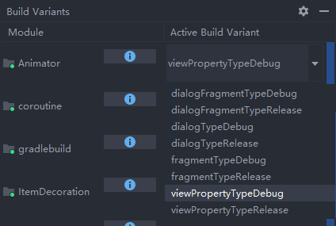

为方便调试，在`build.gradle`中创建了多个构建变体：



这些构建变体的命名是“产品变体+构建类型”，在`build.gradle`中配置产品变体和构建类型后，由`Gradle`创建的。并且为这些构建变体创建了指定的`sourceSet`，不过并未在`build.gradle`的`sourceSets`中指定。


创建这些`sourceSet`主要就是为了能在调试特定模块时，不需要点击就能直接抵达指定页面，减少在开发阶段时的繁琐操作。所以只要在运行指定构建变体时，使用指定清单文件，这样就会直接跳转到指定页面。当然，前提是为每个构建变体的源码集配置好清单文件。

其中，`viewPropertyType`意味着属性动画部分，单独为这个变体设置了`sourceSets`：

```groovy
sourceSets {
    viewPropertyType {
        java.srcDirs = ['src/viewPropertyType/java']
        manifest.srcFile 'src/viewPropertyType/AndroidManifest.xml'
    }
}
```

创建变体和设置`sourceSets`后，就开始创建指定目录和清单文件，清单文件内容如下：

```xml
<?xml version="1.0" encoding="utf-8"?>
<manifest xmlns:android="http://schemas.android.com/apk/res/android"
    package="com.zzq.animator">

    <application
        android:allowBackup="true"
        android:icon="@mipmap/ic_launcher"
        android:label="@string/app_name"
        android:roundIcon="@mipmap/ic_launcher_round"
        android:supportsRtl="true"
        android:theme="@style/AppTheme">
        <activity
            android:name=".activity.ViewPropertyActivity"
            android:label="@string/title_activity_view_property" >
            <intent-filter>
                <action android:name="android.intent.action.MAIN" />

                <category android:name="android.intent.category.LAUNCHER" />
            </intent-filter>
        </activity>
        <activity android:name=".MainActivity">

        </activity>
    </application>

</manifest>
```

所以，在运行前，最好是选择合适的构建变体后再运行，可避免不需要的页面出现