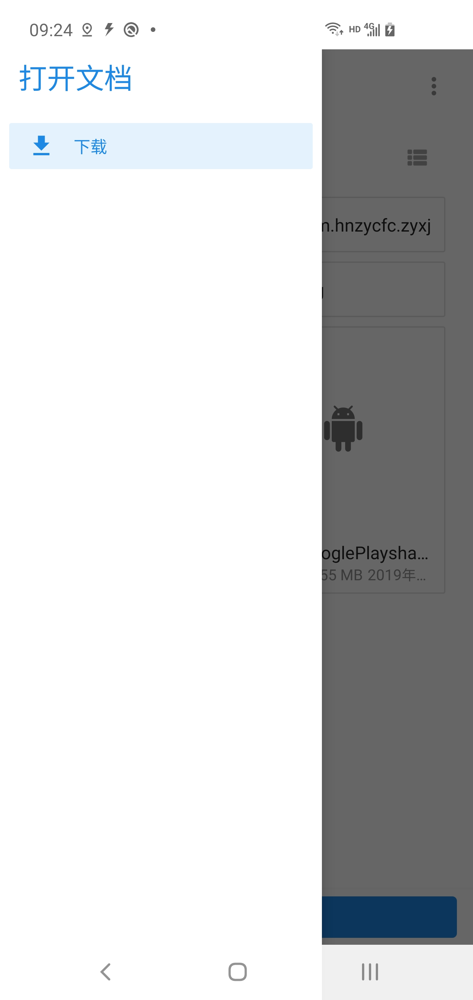
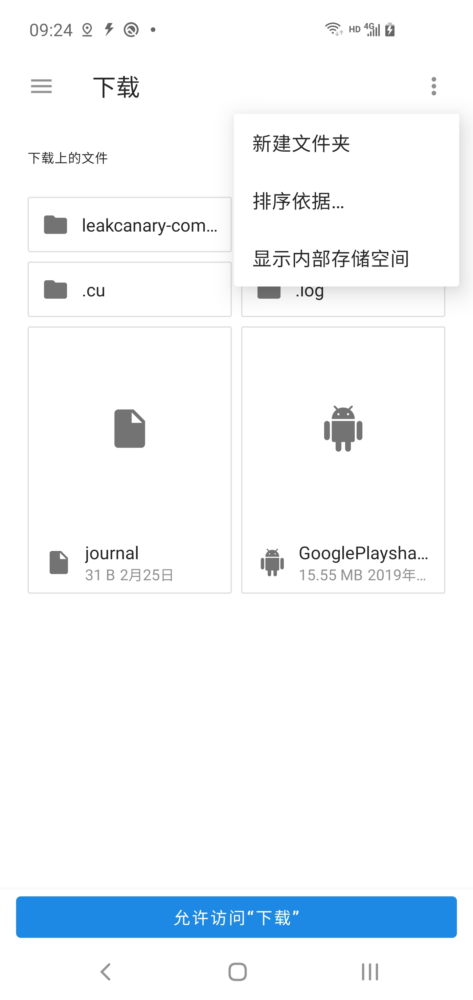
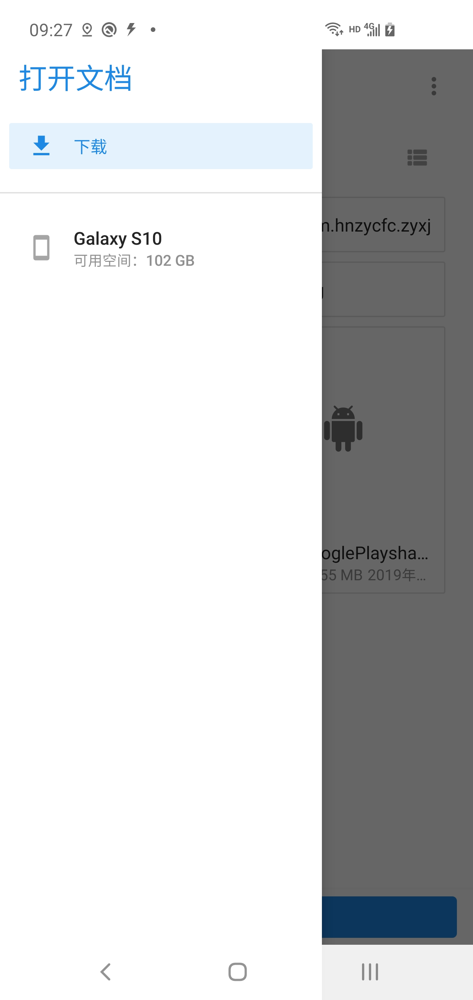
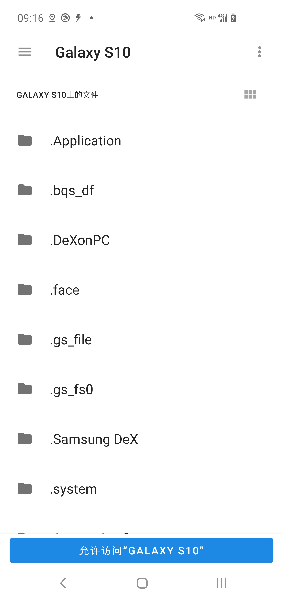
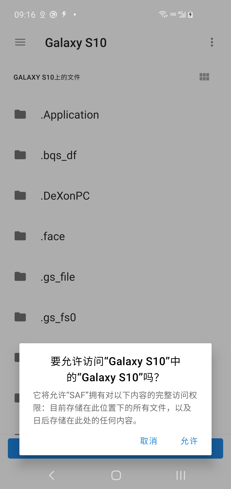

## 概述

SAF，全程为：[Storage Access Framework](https://developer.android.com/guide/topics/providers/document-provider)，本module主要完成对各系统版本中存储部分功能实现，比如Android Q中实现分区功能。在此module中，默认已经将文件和数据存储在外部存储中的私有目录中。

当然，对于根目录等其他文件夹下的读写也是有这个可能会需要，所以会在module中一一实现。对于存储部分的变更，Android Q中变化较大。

## 测试结果

### 读取


### 写入

在commitId为[cb663d35fe38a62f7f78b30cf42d63ba0181d011](https://gitee.com/fmzq/Multiple/commit/cb663d35fe38a62f7f78b30cf42d63ba0181d011)下，已经初步实现在根目录下创建文件，目前分别在两个手机型号中完成测试。

| 手机型号 | 系统版本    | 结果                                   |
| -------- | ----------- | -------------------------------------- |
| 三星S10  | Android 10  | 需要系统确认授予权限后，才会创建文件夹 |
| 一加5    | Android 8.1 | 不需要授予权限，可直接创建文件夹       |

在两部手机中写入文件，步骤都是一样的，打开文件选择器，然后选择好目录，就会创建文件。不同的是，三星S10会弹出弹框是否允许访问，允许后才会去创建。所以在此以S10作为举例。

首先是打开文件选择器，允许用户选择最后文件创建路径。

```kotlin
val intent = Intent(Intent.ACTION_OPEN_DOCUMENT_TREE)
//Intent.FLAG_GRANT_READ_URI_PERMISSION | Intent.FLAG_GRANT_PERSISTABLE_URI_PERMISSION
intent.addFlags(Intent.FLAG_GRANT_READ_URI_PERMISSION or
                Intent.FLAG_GRANT_PERSISTABLE_URI_PERMISSION)
startActivityForResult(intent, codeRootDirectory)
```

注意，在进入文件选择器后，部分手机需要通过右上角菜单，选择“显示内部存储空间”后才能看到手机存储空间，否则只能看到部分文件



显示内部存储空间：



然后就能通过侧边栏看到三星S10的存储空间



进入S10存储空间后，界面下方就会有“允许访问”GALAXY S10“按钮。



选择进入任一文件夹，如zzqSAF，下方按钮文字就会变为”允许访问zzqSAF"。返回至根目录，点击下方按钮，就会弹出对话框，询问用户是否允许APP对内容的完整访问权限。



用户允许后，才会通过`onActivityResult()`返回用户指定文件夹的uri。注意，每一次通过如上代码打开选择器，都需要通过点击按钮来完成，这意味着每一次写入都需要用户手动允许APP访问其指定目录。

获取到uri后，可以通过DocumentFile去创建文件夹和文件。

## 注意

在module中单独添加了`DocumentFile`的依赖：

```groovy
implementation "androidx.documentfile:documentfile:1.0.1"
```

在涉及到Android Q系统中，写入文件到根目录中会有所需要。